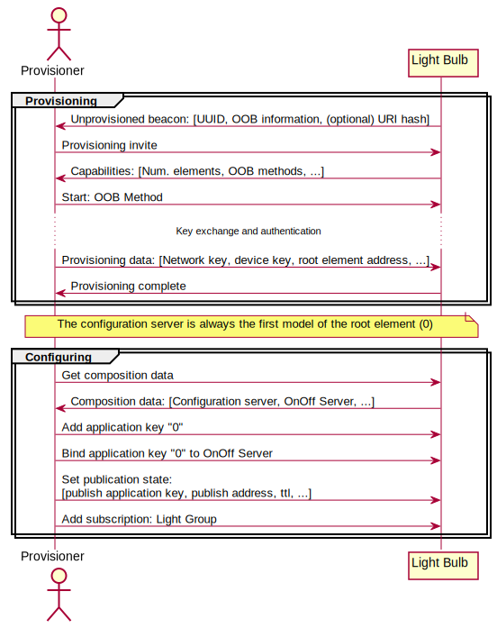

# How to build a network

The following guide describes how to set up a simple Bluetooth Mesh network, using
the [light switch example](@ref md_examples_light_switch_README) as a reference. It will give a
brief conceptual overview of the provisioning and configuration and how the API for it is used in
the example.

See [Basic Bluetooth Mesh concepts](@ref md_doc_introduction_basic_concepts) for a more detailed
overview of the Bluetooth Mesh concepts.

## Provisioning and configuration

Before a device can join a Mesh network, it must be [provisioned](@ref md_doc_getting_started_provisioning).
This process involves authenticating the new device and providing it with basic network information,
a network key, a unique device key, and a reserved unicast address space for its elements.

After provisioning, the device must be configured. The *Configuration Server* model is mandatory for all Bluetooth Mesh
nodes and handles the communication with and instructions from a *Configuration Client* model -- in
practice controlled by the provisioner. It is always allocated at the node's root element, and
communication with it is encrypted with the device's device key. The typical configuration steps are:

1.  Read the composition data of the device. This gives the provisioner information about the metadata of the
    device and which models are bound to what element in the device.
2.  Add the application and/or network key(s).
3.  Bind the key(s) to the different models.
4.  Set the publication state of the models (which address to publish state events to, with what
    key, using what TTL value, etc.).
5.  Manage subscriptions.

## Use case: Simple home lighting

Imagine a use case with one light switch and several light bulbs. The provisionee
(light bulb) will start beaconing its unprovisioned beacon, signaling to the provisioner that it is
looking for a network to join. The provisioner validates the light bulb's beacon and invites it to
join the network. If the authentication succeeds, the device is given the necessary keys and
addresses to be a part of the network and be ready to be configured. Next, the light bulb is given the
"home automation" application key, it is bound to the OnOff Server that controls the light, the
publication state of the OnOff Server is set, and finally a subscription to the "light group" is
added. This message exchange is illustrated in the following figure (note that acknowledgments are excluded in the
figure):

This process is repeated for each light bulb that joins the network.

### Practical example

The light switch example is meant to showcase the API for the provisioner and provisionee roles
and how a simple Bluetooth Mesh network may be configured. The network consists of one combined
provisioner and Simple OnOff *client* (the light switch) and three provisionees with the Simple
OnOff *server* (the light bulbs).

#### Provisionee: light switch server

The light switch server interfaces mainly with two APIs:

1. [Configuration module](@ref NRF_MESH_NODE_CONFIG)
2. [Simple OnOff server model](@ref md_models_simple_on_off_README)

The configuration module implements the behavior of a simple provisionee device. It handles the
interface with the provisioning stack, setting up the configuration server, and restoring the device
state from flash.

As seen in `examples/light_switch/server/src/main.c`, the amount of code needed for the
application is minimal. It implements the following functionality:

1.  Setting basic configuration parameters, supported Out-Of-Bound (OOB) methods, clock configuration, callbacks,
    etc.
2.  Adding models and their event callbacks.

When the `configuration_complete()` callback is called, the device is provisioned and ready to be
configured by the provisioner. The following figure illustrates the setup with the relevant API calls:

#### Provisioner: Light switch client

The light switch client interfaces with the following APIs:

1.  [Core mesh stack](@ref MESH_API_GROUP_CORE)
2.  [Provisioning](@ref MESH_API_GROUP_PROV)
3.  [Configuration client](@ref CONFIG_CLIENT)
4.  [Simple OnOff client](@ref md_models_simple_on_off_README)

In general, the provisioner role is an order of magnitude more complex than the provisionee role, both in
resource requirements and application complexity. Therefore, there is no simple "press play and it
works"-API for the provisioner. However, for a specific use case, it can be reduced into a set of
simple steps, as implemented in the light switch client example:

1.  Initialize:
    1.  Core mesh stack
    2.  Device state manager
    3.  Access layer
    4.  (Optional) Load flash configuration.
2.  Listen for unprovisioned beacons.
3.  Provision device.
4.  Configure device.
5.  If more devices should join the network, go back to step 2.

In the example, the behavior is split between `examples/light_switch/client/src/main.c` and
`examples/light_switch/client/src/provisioner.c`, where the former deals with initialization and
setup, user interfaces, etc. and the latter with the provisioning and configuration states.
The following figure shows the details of how provisioning and configuration are implemented with the provided APIs. Note that the
figure may simplify some API calls to provide a clearer understanding. See the relevant source
files for details.

