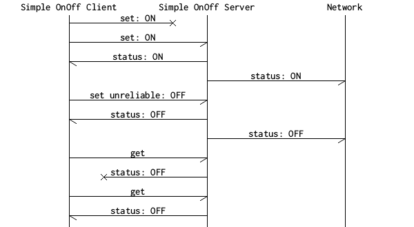

# Creating new models

In the Bluetooth Mesh solution, models are used to define the functionality of nodes.
Each model represents a set of states and behaviors and defines messages that are
used to interact with the model states.

One example of a model is the configuration model, which is a mandatory model in all
mesh devices. This model represents the configuration of a node (in the form of various
states) and provides messages to set or retrieve configuration parameters (behavior).

This guide presents the basics of how to create new models. You may implement your own
vendor-specific model which will enable your devices to provide custom states and behaviors not
covered by the already defined standard models.

For the list of available Mesh Model APIs, see \ref MESH_API_GROUP_MODELS in the API Reference section.

**Table of contents**
- [Implementing models with the mesh stack](@ref creating_models_implementing)
    - [Publication](@ref creating_models_publication)
    - [Subscription](@ref creating_models_subscription)
- [Example: A vendor-specific Simple OnOff model](@ref creating_models_example)
    - [The server model](@ref creating_models_example_server)
    - [The client model](@ref creating_models_example_client)


---


## Implementing models with the mesh stack @anchor creating_models_implementing

To implement a model, you must take the following basic steps:

* **Define opcode handlers**: Define a table of handlers for incoming messages by creating an array
  of `access_opcode_handler_t`. Each element in this array functions as a lookup table entry for
  handling opcodes of incoming messages destined for this model.
* **Allocate and bind the model to an element**: Use the `access_model_add()` API to allocate,
  initialize, and bind the model to the element at the given element index. This model instance is
  identified by a handle value assigned to the output parameter `p_model_handle`. Use this handle when
  calling access layer API functions. All models must be bound to an element. An element represents
  an addressable unit in a device, such as a light bulb in a light fixture. Therefore, each element
  is assigned a separate unicast address by the provisioner.

  Note that a model can extend one or more other models. These parent model instances can be bound
  to different elements, making the complete model span multiple elements.
  These models are called extended models. Refer to the Mesh Model Specification of
  the @link_btsig_spec<!-- https://www.bluetooth.com/specifications/mesh-specifications -->,
  for more information and examples.

### Publication @anchor creating_models_publication

Sending messages from models is done via publication. Each model has a publish address. Publication
of messages can be periodic or one-shot, and published messages can be sent to either
a unicast, group, or virtual address. Configuration of publication related states is generally
controlled by a provisioner via the configuration model. Publication is useful for allowing, for
example, sensor nodes to periodically report data readings. A message can be published
by using the `access_model_publish()` API function, which will publish a message according
to the publication settings (interval, destination) of the model.

Publication is also used by client models to send messages to server models.
In many cases, however, the application wants to control the destination of messages
published from a client model instead of relying on an external provisioner (in many
cases, the application containing the client *is* the provisioner). For this purpose,
the API function `access_model_publish_address_set()` is provided.

### Subscription @anchor creating_models_subscription

Subscriptions allow models to listen for incoming messages from specific addresses.
This can be used to listen to, for example, periodic messages published from sensor nodes.
To allow a model to subscribe to an address, you first need to allocate a subscription
list, using the `access_model_subscription_list_alloc()` API function.

@note
When using a client model, it is not required to subscribe to the address you
are sending messages to in order to receive replies to those messages. Subscriptions are
only used to receive unsolicited messages from nodes.


---


## Example: A vendor-specific Simple OnOff model @anchor creating_models_example

The following sections of this guide show how to implement a vendor-specific Simple OnOff model
that can be used to turn something (such as a light bulb, heater, or washing machine) on or off.

@note
The Mesh Model Specification specifies a model called the "Generic OnOff Model",
which should be used in real applications using the mesh. However, the example model described in
this guide is simpler and serves as a nice introductory example for creating a custom mesh model.

A mesh application is specified using a client-server architecture, where client and server
models use publish/subscribe mechanism to communicate with each other. Therefore, the intended
functionality of this model will be realized using two parts: the server model, maintaining
the OnOff state, and a client model, used for manipulating the OnOff state on the server.

When this server model receives a GET or (reliable) SET message from a client model, it sends the
current value of the OnOff state as response. This keeps the client up-to-date about the server
state.

The following table shows the opcodes that are supported by this model:

| Name               | Definition                               | Opcode       | Description                   | Parameter     | Parameter size |
| ------------------ | -----------------------------------------| ------------:| ----------------------------- | ------------- | --------------:|
| SET                | `::SIMPLE_ON_OFF_OPCODE_SET`             |         0xc1 | Sets the current on/off state | New state     |         1 byte |
| GET                | `::SIMPLE_ON_OFF_OPCODE_GET`             |         0xc2 | Gets the current on/off state | N/A           |   No parameter |
| SET UNRELIABLE     | `::SIMPLE_ON_OFF_OPCODE_SET_UNRELIABLE`  |         0xc3 | Sets the current on/off state | New state     |         1 byte |
| Status             | `::SIMPLE_ON_OFF_OPCODE_STATUS`          |         0xc4 | Contains the current state    | Current state |         1 byte |

The opcodes sent on-air are *three bytes* for the vendor-specific models. The
complete opcode is the combination of the vendor-specific opcode and the company identifier. For more
information, see the `access_opcode_t` documentation.

We will use the following identifiers for this model:

| Description        | Value     |
| ------------------ | ---------:|
| Company identifier |    0x0059 |
| Server identifier  |    0x0000 |
| Client identifier  |    0x0001 |

The company identifier used in this table is Nordic Semiconductor's assigned Bluetooth
company ID. In a real application, you should use your own company's assigned ID.

While following this guide, keep in mind that some important features such as error handling
have been skipped for brevity. However, when writing your application, you should take care
to check the error codes returned from all API functions to prevent easily avoidable bugs
from entering your application.

If you want to explore a complete model implementation using the same basic layout as described
in this guide, take a look at the `models/vendor/simple_on_off` directory.
In addition, if you want to see it integrated into a complete application, take a look at
the @ref md_examples_light_switch_README in the `examples/light_switch` directory.

### The server model @anchor creating_models_example_server

The behavior of the simple OnOff server is very simple and illustrated by the following message chart.


When the OnOff server receives SET and GET messages, it calls a callback function provided
by the application and shares/requests the data through callback function parameters. For this,
we need to define a model context structure that contains pointers to the callback functions.
This context structure gets passed to all message handlers. The following code snippet shows the
context structure needed for the server model (`simple_on_off_server_t`):

```C
/** Forward declaration. */
typedef struct __simple_on_off_server simple_on_off_server_t;

/**
 * Get callback type.
 * @param[in] p_self Pointer to the Simple OnOff Server context structure.
 * @returns @c true if the state is On, @c false otherwise.
 */
typedef bool (*simple_on_off_get_cb_t)(const simple_on_off_server_t * p_self);

/**
 * Set callback type.
 * @param[in] p_self Pointer to the Simple OnOff Server context structure.
 * @param[in] on_off Desired state
 * @returns @c true if the set operation was successful, @c false otherwise.
 */
typedef bool (*simple_on_off_set_cb_t)(const simple_on_off_server_t * p_self, bool on_off);

/** Simple OnOff Server state structure. */
struct __simple_on_off_server
{
    /** Model handle assigned to the server. */
    access_model_handle_t model_handle;
    /** Get callback. */
    simple_on_off_get_cb_t get_cb;
    /** Set callback. */
    simple_on_off_set_cb_t set_cb;
};
```

Next, we need to define the opcodes and create necessary opcode handler functions to handle
incoming messages for the server model.
All opcode handlers of all the models shall use the same function prototype as defined below:

```C
typedef void (*access_opcode_handler_cb_t)(access_model_handle_t handle,
                                           const access_message_rx_t * p_message,
                                           void * p_args);
```


We need three opcode handlers in the server to handle `::SIMPLE_ON_OFF_OPCODE_GET`,
`::SIMPLE_ON_OFF_OPCODE_SET`, and `::SIMPLE_ON_OFF_OPCODE_SET_UNRELIABLE` messages. Each of
these opcode handlers will call the corresponding user callback function from the context
structure. This context structure gets passed to the opcode handlers via the `p_args` parameter.


Additonally, as defined in section 3.7.5.2 of the Mesh Profile Specification v1.0, an acknowledged
message is transmitted and acknowledged by each receiving element by responding to that message.
The response is typically a status message.
The status message usually contains the current value of the state set by the SET message.
Therefore, the model uses the `set_cb()` callback to fetch the current OnOff state value from the
user application and sends this value using the `reply_status()` function.
The server model also publishes its state in response to any received message, using the
`publish_state()` function, if its publish address is set by the provisioner.

The following snippet shows the opcode handlers defined for the Simple OnOff server model:

```C
static void handle_set_cb(access_model_handle_t handle, const access_message_rx_t * p_message, void * p_args)
{
    simple_on_off_server_t * p_server = p_args;
    NRF_MESH_ASSERT(p_server->set_cb != NULL);

    bool value = (((simple_on_off_msg_set_t*) p_message->p_data)->on_off) > 0;
    value = p_server->set_cb(p_server, value);
    reply_status(p_server, p_message, value);
    publish_state(p_server, value);
}

static void handle_get_cb(access_model_handle_t handle, const access_message_rx_t * p_message, void * p_args)
{
    simple_on_off_server_t * p_server = p_args;
    NRF_MESH_ASSERT(p_server->get_cb != NULL);
    reply_status(p_server, p_message, p_server->get_cb(p_server));
}

static void handle_set_unreliable_cb(access_model_handle_t handle, const access_message_rx_t * p_message, void * p_args)
{
    simple_on_off_server_t * p_server = p_args;
    NRF_MESH_ASSERT(p_server->set_cb != NULL);
    bool value = (((simple_on_off_msg_set_unreliable_t*) p_message->p_data)->on_off) > 0;
    value = p_server->set_cb(p_server, value);
    publish_state(p_server, value);
}
```

The `reply_status()` function sends the value of the current state in an `::SIMPLE_ON_OFF_OPCODE_STATUS`
message as a reply to the client using the `access_model_reply()` API.
This API requires certain parameters to send the message correctly, which is why it has been wrapped
in `send_reply()`. Implement `send_reply()` like this:

```C
static void reply_status(const simple_on_off_server_t * p_server,
                         const access_message_rx_t * p_message,
                         bool present_on_off)
{
    simple_on_off_msg_status_t status;
    status.present_on_off = present_on_off ? 1 : 0;
    access_message_tx_t reply;
    reply.opcode.opcode = SIMPLE_ON_OFF_OPCODE_STATUS;
    reply.opcode.company_id = ACCESS_COMPANY_ID_NORDIC;
    reply.p_buffer = (const uint8_t *) &status;
    reply.length = sizeof(status);
    reply.force_segmented = false;
    reply.transmic_size = NRF_MESH_TRANSMIC_SIZE_DEFAULT;

    (void) access_model_reply(p_server->model_handle, p_message, &reply);
}
```

The `publish_state()` function is very similar to the `reply_status()` function, except it uses
the `access_model_publish()` API to publish the response message.
If the publish address of the client model is not configured by the provisioner, the
`access_model_publish()` will not publish the given message.

To link a given opcode and company ID to its corresponding handler function, an opcode handler
lookup table is specified. This lookup table is given as an input parameter when registering the
model with the access layer. Each entry in the table is of the `access_opcode_handler_t` type and
consists of the opcode, vendor ID, and an opcode handler function pointer. For the server model it
is defined as:

```C
static const access_opcode_handler_t m_opcode_handlers[] =
{
    {ACCESS_OPCODE_VENDOR(SIMPLE_ON_OFF_OPCODE_SET,            ACCESS_COMPANY_ID_NORDIC), handle_set_cb},
    {ACCESS_OPCODE_VENDOR(SIMPLE_ON_OFF_OPCODE_GET,            ACCESS_COMPANY_ID_NORDIC), handle_get_cb},
    {ACCESS_OPCODE_VENDOR(SIMPLE_ON_OFF_OPCODE_SET_UNRELIABLE, ACCESS_COMPANY_ID_NORDIC), handle_set_unreliable_cb}
};
```

We now have everything we need to put the model together in an initialization function. The
initialization function must allocate and add the model to the access layer:

```C
uint32_t simple_on_off_server_init(simple_on_off_server_t * p_server, uint16_t element_index)
{
    if (p_server == NULL ||
        p_server->get_cb == NULL ||
        p_server->set_cb == NULL)
    {
        return NRF_ERROR_NULL;
    }

    access_model_add_params_t init_params;
    init_params.element_index =  element_index;
    init_params.model_id.model_id = SIMPLE_ON_OFF_SERVER_MODEL_ID;
    init_params.model_id.company_id = ACCESS_COMPANY_ID_NORDIC;
    init_params.p_opcode_handlers = &m_opcode_handlers[0];
    init_params.opcode_count = sizeof(m_opcode_handlers) / sizeof(m_opcode_handlers[0]);
    init_params.p_args = p_server;
    init_params.publish_timeout_cb = NULL;
    return access_model_add(&init_params, &p_server->model_handle);
}
```

You now have the basic skeleton of a simple OnOff server model, which can be expanded
or tweaked to produce more complex server models. See `models/vendor/simple_on_off/` for the
complete code of this model.

### The client model @anchor creating_models_example_client

The client model is used to interact with the corresponding server model. It sends
SET and GET messages and processes incoming status replies. The client model sends messages using
a publish mechanism. It uses assigned publication address as a destination for outgoing messages.

Just as in the server implementation, the client needs a context structure to keep
information about callbacks and its model handle. In addition, we use a boolean
variable to keep track of whether a transaction is currently active and to
prevent running multiple simultaneous transactions.

In a mesh network, messages may be delivered out of order, or may not be delivered at all.
Therefore, a client should perform only one transaction at a time with its corresponding server.

The client model uses a callback function to provide information about the state of the server to
the user application. If the server does not reply within a given time frame, it will notify the
user application with the error code `::SIMPLE_ON_OFF_STATUS_ERROR_NO_REPLY`.

The following code snippet shows the status codes (`::simple_on_off_status_t`) and the context
structure (`simple_on_off_client_t`) needed for this model:

```C
/** Simple OnOff status codes. */
typedef enum
{
    /** Received status ON from the server. */
    SIMPLE_ON_OFF_STATUS_ON,
    /** Received status OFF from the server. */
    SIMPLE_ON_OFF_STATUS_OFF,
    /** The server did not reply to a Simple OnOff Set/Get. */
    SIMPLE_ON_OFF_STATUS_ERROR_NO_REPLY
} simple_on_off_status_t;

/** Forward declaration. */
typedef struct __simple_on_off_client simple_on_off_client_t;

/**
 * Simple OnOff status callback type.
 *
 * @param[in] p_self Pointer to the Simple OnOff client structure that received the status.
 * @param[in] status The received status of the remote server.
 * @param[in] src    Element address of the remote server.
 */
typedef void (*simple_on_off_status_cb_t)(const simple_on_off_client_t * p_self, simple_on_off_status_t status, uint16_t src);

/** Simple OnOff Client state structure. */
struct __simple_on_off_client
{
    /** Model handle assigned to the client. */
    access_model_handle_t model_handle;
    /** Status callback called after status received from server. */
    simple_on_off_status_cb_t status_cb;
    /** Internal client state. */
    struct
    {
        bool reliable_transfer_active; /**< Variable used to determine if a transfer is currently active. */
        simple_on_off_msg_set_t data;  /**< Variable reflecting the data stored in the server. */
    } state;
};
```

The client model can send two kinds of messages: a reliable (acknowledged) message and an unreliable
(unacknowledged) message. The client model needs to use the `access_model_reliable_publish()` API to
send a reliable message, and the `access_model_publish()` API is used to send an unreliable message.

The `access_model_reliable_publish()` API guarantees delivery of a message by retransmitting it
until a reply is received from the destination node or the transaction times out.
When the transaction finishes (or times out), a callback function is called to notify the client model.
If no response from the server model is received for the acknowledged SET message, a
corresponding error is notified to the user application by calling the user's status callback.

The following snippet shows the `reliable_status_cb()` callback and the `send_reliable_message()`
function for the client model:

```C
static void reliable_status_cb(access_model_handle_t model_handle,
                               void * p_args,
                               access_reliable_status_t status)
{
    simple_on_off_client_t * p_client = p_args;
    NRF_MESH_ASSERT(p_client->status_cb != NULL);

    p_client->state.reliable_transfer_active = false;
    switch (status)
    {
        case ACCESS_RELIABLE_TRANSFER_SUCCESS:
            /* Ignore */
            break;
        case ACCESS_RELIABLE_TRANSFER_TIMEOUT:
            p_client->status_cb(p_client, SIMPLE_ON_OFF_STATUS_ERROR_NO_REPLY, NRF_MESH_ADDR_UNASSIGNED);
            break;
        case ACCESS_RELIABLE_TRANSFER_CANCELLED:
            p_client->status_cb(p_client, SIMPLE_ON_OFF_STATUS_CANCELLED, NRF_MESH_ADDR_UNASSIGNED);
            break;
        default:
            /* Should not be possible. */
            NRF_MESH_ASSERT(false);
            break;
    }
}

static uint32_t send_reliable_message(const simple_on_off_client_t * p_client,
                                      simple_on_off_opcode_t opcode,
                                      const uint8_t * p_data,
                                      uint16_t length)
{
    access_reliable_t reliable;
    reliable.model_handle = p_client->model_handle;
    reliable.message.p_buffer = p_data;
    reliable.message.length = length;
    reliable.message.opcode.opcode = opcode;
    reliable.message.opcode.company_id = ACCESS_COMPANY_ID_NORDIC;
    reliable.message.force_segmented = false;
    reliable.message.transmic_size = NRF_MESH_TRANSMIC_SIZE_DEFAULT;
    reliable.reply_opcode.opcode = SIMPLE_ON_OFF_OPCODE_STATUS;
    reliable.reply_opcode.company_id = ACCESS_COMPANY_ID_NORDIC;
    reliable.timeout = ACCESS_RELIABLE_TIMEOUT_MIN;
    reliable.status_cb = reliable_status_cb;

    return access_model_reliable_publish(&reliable);
}
```

Now we need to create API functions for the user application to send GET and SET messages.
The following snippet defines these functions:

```C
uint32_t simple_on_off_client_set(simple_on_off_client_t * p_client, bool on_off)
{
    if (p_client == NULL || p_client->status_cb == NULL)
    {
        return NRF_ERROR_NULL;
    }
    else if (p_client->state.reliable_transfer_active)
    {
        return NRF_ERROR_INVALID_STATE;
    }

    p_client->state.data.on_off = on_off ? 1 : 0;
    p_client->state.data.tid = m_tid++;

    uint32_t status = send_reliable_message(p_client,
                                            SIMPLE_ON_OFF_OPCODE_SET,
                                            (const uint8_t *)&p_client->state.data,
                                            sizeof(simple_on_off_msg_set_t));
    if (status == NRF_SUCCESS)
    {
        p_client->state.reliable_transfer_active = true;
    }
    return status;

}

uint32_t simple_on_off_client_set_unreliable(simple_on_off_client_t * p_client, bool on_off, uint8_t repeats)
{
    simple_on_off_msg_set_unreliable_t set_unreliable;
    set_unreliable.on_off = on_off ? 1 : 0;
    set_unreliable.tid = m_tid++;

    access_message_tx_t message;
    message.opcode.opcode = SIMPLE_ON_OFF_OPCODE_SET_UNRELIABLE;
    message.opcode.company_id = ACCESS_COMPANY_ID_NORDIC;
    message.p_buffer = (const uint8_t*) &set_unreliable;
    message.length = sizeof(set_unreliable);
    message.force_segmented = false;
    message.transmic_size = NRF_MESH_TRANSMIC_SIZE_DEFAULT;

    uint32_t status = NRF_SUCCESS;
    for (uint8_t i = 0; i < repeats; ++i)
    {
        status = access_model_publish(p_client->model_handle, &message);
        if (status != NRF_SUCCESS)
        {
            break;
        }
    }
    return status;
}

uint32_t simple_on_off_client_get(simple_on_off_client_t * p_client)
{
    if (p_client == NULL || p_client->status_cb == NULL)
    {
        return NRF_ERROR_NULL;
    }
    else if (p_client->state.reliable_transfer_active)
    {
        return NRF_ERROR_INVALID_STATE;
    }

    uint32_t status = send_reliable_message(p_client,
                                            SIMPLE_ON_OFF_OPCODE_GET,
                                            NULL,
                                            0);
    if (status == NRF_SUCCESS)
    {
        p_client->state.reliable_transfer_active = true;
    }
    return status;
}
```

To process the reply message, we need to add an opcode handler for the `::SIMPLE_ON_OFF_OPCODE_STATUS`
opcode. All incoming messages, even when they are a reply to a message that was sent from the node,
need an opcode handler to be processed. This snippet shows the opcode handler implementation and
defines the opcode handler lookup table for the client model:

```C
static void handle_status_cb(access_model_handle_t handle, const access_message_rx_t * p_message, void * p_args)
{
    simple_on_off_client_t * p_client = p_args;
    NRF_MESH_ASSERT(p_client->status_cb != NULL);

    if (!is_valid_source(p_client, p_message))
    {
        return;
    }

    simple_on_off_msg_status_t * p_status =
        (simple_on_off_msg_status_t *) p_message->p_data;
    simple_on_off_status_t on_off_status = (p_status->present_on_off ?
                                              SIMPLE_ON_OFF_STATUS_ON : SIMPLE_ON_OFF_STATUS_OFF);
    p_client->status_cb(p_client, on_off_status, p_message->meta_data.src.value);
}

static const access_opcode_handler_t m_opcode_handlers[] =
{
    {{SIMPLE_ON_OFF_OPCODE_STATUS, ACCESS_COMPANY_ID_NORDIC}, rx_status_cb}
};
```

The client model initialization is done in exactly the
same way as the server model:

```C
uint32_t simple_on_off_client_init(simple_on_off_client_t * p_client, uint16_t element_index)
{
    if (p_client == NULL ||
        p_client->status_cb == NULL)
    {
        return NRF_ERROR_NULL;
    }

    access_model_add_params_t init_params;
    init_params.model_id.model_id = SIMPLE_ON_OFF_CLIENT_MODEL_ID;
    init_params.model_id.company_id = ACCESS_COMPANY_ID_NORDIC;
    init_params.element_index = element_index;
    init_params.p_opcode_handlers = &m_opcode_handlers[0];
    init_params.opcode_count = sizeof(m_opcode_handlers) / sizeof(m_opcode_handlers[0]);
    init_params.p_args = p_client;
    init_params.publish_timeout_cb = NULL;
    return access_model_add(&init_params, &p_client->model_handle);
}
```
The client is now complete, and you should be able to use it to turn something
on or off by communicating with the server node!

