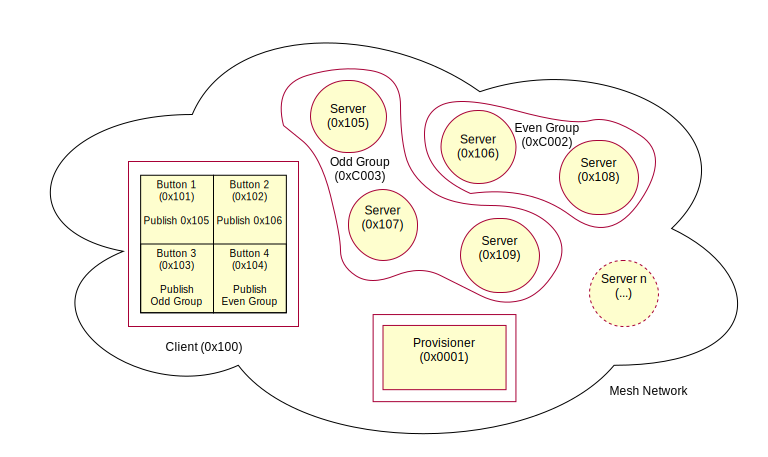

# Quick start guide: Running a first example

This is a quick demonstration of some of the basic concepts of the Bluetooth Mesh
network using Nordic's nRF5 SDK for Mesh. You don't need to build any binaries for running it,
as it uses pre-built binaries of the [light switch examples](@ref md_examples_light_switch_README).

The [light switch examples](@ref md_examples_light_switch_README) demonstrate the major parts of
the mesh network ecosystem.

These examples contain three sub-examples:
- Light switch server: A minimalistic server that implements a vendor-specific
[Generic OnOff server model](@ref GENERIC_ONOFF_MODEL), which is used to
receive the state data and control the state of LED 1 on the board.
- Light switch client: A minimalistic client that implements four instances of a vendor-specific
[Generic OnOff client model](@ref GENERIC_ONOFF_MODEL).
When a user presses any of the buttons, an OnOff Set message is sent out to the
configured destination address.
- Mesh Provisioner: A simple static provisioner implementation. This provisioner provisions all
the nodes in one mesh network. Additionally, the provisioner also configures bindings
and publication and subscription settings of mesh model instances on these nodes
to enable them to talk to each other.

In the following sections, these three example applications will be referred to as the server, the client, and the provisioner, respectively.

**Table of contents**
- [Hardware requirements](@ref mesh_quick_start_hw_reqs)
- [Software requirements](@ref mesh_quick_start_sw_reqs)
- [Setup](@ref mesh_quick_start_setup)
	- [LED and button assignments](@ref mesh_quick_start_setup_assignments)
- [Flashing the example firmware](@ref mesh_quick_start_flashing)
- [Running and observing the first example](@ref mesh_quick_start_running)
	- [Running the first example with RTT logs](@ref mesh_quick_start_running_logs)
- [More information and further reading](@ref mesh_quick_start_further_reading)

---

## Hardware requirements @anchor mesh_quick_start_hw_reqs
You need at least three @link_nrf52dk <!-- https://www.nordicsemi.com/Software-and-Tools/Development-Kits/nRF52-DK --> boards for this example:

- One nRF5 development board for the client.
- One nRF5 development board for the provisioner.
- One or more nRF5 development boards for the servers (maximum up to 30 boards).

See [Compatibility](@ref md_doc_introduction_mesh_compatibility) for information about the supported boards.

---

## Software requirements @anchor mesh_quick_start_sw_reqs

Although this first example does not require you to install the complete toolchain, you still need the following software:

- nRF5 SDK for Mesh.
@link_MeshSdk_download <!-- nRF5 SDK for Mesh download: https://www.nordicsemi.com/Software-and-Tools/Software/nRF5-SDK-for-Mesh --> and extract the SDK archive.

- nrfjprog (recommended for flashing the devices). Download and install 
@link_nrf5x_cmd_line_tools_w32 <!-- Command line tools for Windows: https://www.nordicsemi.com/Software-and-Tools/Development-Tools/nRF5-Command-Line-Tools --> or @link_nrf5x_cmd_line_tools_linux<!-- Command line tools for Linux: https://www.nordicsemi.com/Software-and-Tools/Development-Tools/nRF5-Command-Line-Tools -->.

- <a href="https://www.python.org/downloads/" target="_blank">Python 3</a> or <a href="https://www.python.org/downloads/" target="_blank">Python 2.7</a>.

@note
On Debian/Ubuntu, you must reload the udev rules after installing the nRF5x Command Line Tools:
		
		$ sudo udevadm control --reload
		$ sudo udevadm trigger --action=add

---

## Setup @anchor mesh_quick_start_setup

You can find the source code of the example in the following folder:
`<InstallFolder>\examples\light_switch`

The following figure gives the overall view of the mesh network that will be set up
in this first example. Numbers in parentheses indicate the addresses that are assigned
to these nodes by the provisioner.

### LED and button assignments @anchor mesh_quick_start_setup_assignments

The buttons (1 to 4) are used to initiate certain actions, and the LEDs (1 to 4) are used to reflect the status of actions as follows:

- Server:
    -  During provisioning process:
        - LED 2 and 3 blinking: Device identification active.
		- LED 1 to 4: Blink four times to indicate provisioning process is completed.
    - After provisioning and configuration is over:
        - LED 1: Reflects the value of OnOff state on the server.
				- LED ON: Value of the OnOff state is 1 (`true`).
				- LED OFF: Value of the OnOff state is 0 (`false`).
		
- Client:
    - During provisioning process:
        - LED 2 and 3 blinking: Device identification active.
		- LED 1 to 4: Blink four times to indicate provisioning process is completed.
    - After provisioning and configuration is over, buttons on the client are used to send OnOff Set
        messages to the servers:
        - Button 1: Send a message to the odd group (address: 0xC003) to turn on LED 1.
        - Button 2: Send a message to the odd group (address: 0xC003) to turn off LED 1.
        - Button 3: Send a message to the even group (address: 0xC002) to turn on LED 1.
        - Button 4: Send a message to the even group (address: 0xC002) to turn off LED 1.

- Provisioner:
  - Button 1: Start provisioning.
  - LED 1: Reflects the state of the provisioning.
		- LED ON: Provisioning of the node is in progress.
		- LED OFF: No ongoing provisioning process.
  - LED 2: Reflects the state of the configuration.
		- LED ON: Configuration of the node is in progress.
		- LED OFF: No ongoing configuration process.
				

---

## Flashing the example firmware @anchor mesh_quick_start_flashing

Before running the first example, you need to flash the boards.
You must specify the client and the provisioner boards, whereas the server firmware is automatically loaded to the rest of connected boards.

To flash the example firmware on the client and the provisioner:

1. Connect the nRF5 boards to the USB ports.
	@note If you do not have a sufficient number of USB ports, you can program the boards one by one. In
	this case, switch off or disconnect the boards that you have finished programming to
	prevent them from being overwritten by the script.
2. Decide which one you want to use as client and which one as provisioner.
3. Note down the 9-digit SEGGER IDs of the client board and the provisioner board.
4. Execute the python script in one of the following ways:
	- let the script ask you to choose the provisioner and client boards:

			nrf5_sdk_for_mesh$ python scripts/quick_start/quick_start_demo.py

	- specify the provisioner and client boards manually by providing SEGGER IDs for the provisioner (`-p`) and client (`-c`):

			nrf5_sdk_for_mesh$ python scripts/quick_start/quick_start_demo.py -p 682438729 -c 682204868

		@note You can also use the command line switch `-v` if you want to increase the verbosity of the output.

The script flashes the required SoftDevice and example firmware on the boards.

When the flashing is complete, the script executes a reset operation to start the example applications.

---
  

## Running and observing the first example @anchor mesh_quick_start_running

After the reset, the provisioner waits for user input. Follow these steps to see the mesh network in action:

1. Press Button 1 on the provisioner board to start the provisioning process:
	- The provisioner first provisions and configures the client and assigns the address 0x100 to the client
   node.
	- The two instances of the OnOff client models are instantiated on separate secondary elements. For this reason, they get consecutive addresses starting with 0x101.
	- Finally, the provisioner picks up the available devices at random, assigns them consecutive addresses, and adds them to odd and even groups.
2. Observe the LED status on the provisioner, client, and server boards.
3. Wait until LED 1 on the provisioner board remains ON steadily for a few seconds, which indicates that all available boards have been provisioned and configured.
4. Press buttons on the client board to change the state of LED 1 on the server boards:
	1. Press Button 1 on the client board to turn ON LED 1 on all servers with ODD addresses.
	2. Press Button 2 on the client board to turn OFF LED 1 on all servers with ODD addresses.
	3. Press Button 3 on the client board to turn ON LED 1 on all servers with EVEN addresses.
	4. Press Button 4 on the client board to turn OFF LED 1 on all servers with EVEN addresses.
5. Press Button 1 on the servers to locally change the state of LED 1 and observe that the client receives
the status message from the corresponding server containing the new state value.
	
### Running the first example with RTT logs @anchor mesh_quick_start_running_logs

If you want to see the RTT logs printed during the provisioning and configuration process:
1. Connect J-Link RTT viewer to the provisioner or client board.
2. Repeat all the steps from [Flashing the example firmware](@ref mesh_quick_start_flashing).
3. Go through the steps 1-4 from [Running and observing the first example](@ref mesh_quick_start_running).
4. In the client's RTT log status, observe messages sent by the servers in response to the acknowledged
Set messages.
	- The client example sends acknowledged Set messages only to odd servers, and hence only those
	servers respond with status messages.
	- Additionally, the provisioner enables publication for all servers, so that they can publish messages to their corresponding group client.
5. Go through the step 5 from [Running and observing the first example](@ref mesh_quick_start_running).
6. In the server's RTT log status, observe message sent by the server.

---

## More information and further reading @anchor mesh_quick_start_further_reading

See the @ref md_doc_getting_started_getting_started section for information on environment setup, including
[installing the mesh toolchain](@ref md_doc_getting_started_how_to_toolchain), [building the mesh stack and examples](@ref md_doc_getting_started_how_to_build), [running examples](@ref md_doc_getting_started_how_to_run_examples), and more.

Once you set up your nRF5 SDK for Mesh environment, see the [example documentation](@ref md_examples_README) for more detailed information
about [light switch](@ref md_examples_light_switch_README) and other examples.