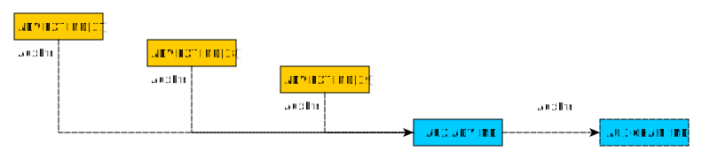

# Nordic Advertiser Extensions (Instaburst)

@note
This feature is experimental, meaning it is ready for use, but not qualified.

The Instaburst feature is a drop-in replacement for the standard BLE Advertiser
bearer for the mesh. When enabled, all communication in the core mesh will happen through
Instaburst instead of regular advertisers, yielding higher throughput, but breaking
compatibility with other Bluetooth Mesh implementations.

Instaburst is a Nordic proprietary feature that does not adhere to the Bluetooth Mesh
specification. It is currently in an experimental stage, and does not have the same requirements
to test coverage, API stability or spec-compliance as the rest of the Nordic nRF5 SDK for Mesh.

**Table of contents**
- [Protocol](@ref instaburst_protocol)
- [Extended advertisements](@ref instaburst_extended_advertisements)
- [Usage in the mesh](@ref instaburst_usage)
    - [Performance](@ref instaburst_usage_performance)
- [TX Buffer management](@ref instaburst_tx_buffer)
    - [Advertising events](@ref instaburst_tx_buffer_advertising_evt)
    - [Packets](@ref instaburst_tx_buffer_packets)

---

## Protocol @anchor instaburst_protocol

Instaburst uses a subset of the Bluetooth 5.0 Extended advertising events feature to increase the
throughput. It runs a dynamic buffer allocation algorithm, that makes a per-packet decision on
whether to transmit it as a regular advertisement packet, or as an extended advertising event.
This maximizes throughput while minimizing the radio time spent by each mesh device.

---

## Extended advertisements @anchor instaburst_extended_advertisements

All Instaburst usage of advertising extensions is done with a locked configuration - it always runs
an uncoded 2Mbit bearer and a fixed, minimal delay from the indication packet to the first
auxiliary packet.

Every advertisement event contains three extended advertisement packets (*ADV_EXT_IND* in the Bluetooth
specification), which all point to a single auxiliary advertisement packet (*AUX_ADV_IND* in the
Bluetooth specification). If a bigger payload is required, this packet can point to a second
auxiliary packet (*AUX_CHAIN_IND* in the Bluetooth specification), which contains more data. To
remain scalable for larger mesh networks, the chain length is limited to this initial auxiliary
packet and a single chain packet.

For more information about the extended advertisement protocol, please refer to the Bluetooth Core 5.0 specification.

---

## Usage in the mesh @anchor instaburst_usage

If Instaburst is enabled in the build, the mesh will instantiate an Instaburst TX instance instead of
its usual advertiser instance for the core message sending.

For RX, the mesh registers a processing callback with the Instaburst RX module, and funnels the
payload into the @ref AD_LISTENER for processing. The Instaburst packets come with their own set of
metadata, that's presented to the upper layers.

To enable usage in the mesh, enable the `EXPERIMENTAL_INSTABURST_ENABLED` option in the CMake
configuration. This will also enable it for the Segger Embedded Studio project files, which have to
be regenerated. See @ref md_doc_getting_started_how_to_build for instructions on how to do this.

### Performance @anchor instaburst_usage_performance

In optimal conditions, Instaburst is able to transmit 498 bytes of raw advertising data every
advertising interval, providing a 160kbps bearer to the upper layers for 20ms advertisement
intervals. The mesh packets have significant overhead however, and under the same conditions,
the maximum theoretical access layer payload throughput is around 60kbps.

---

## TX Buffer management @anchor instaburst_tx_buffer

As the extended advertising packets have dynamically sized headers, and are allocated on a
per-advertising event basis, the buffer management in the Instaburst TX module diverges from
the pattern of the advertiser module.

### Advertising events @anchor instaburst_tx_buffer_advertising_evt

The Instaburst packets are allocated on a per-advertising event basis, with metadata for the event,
a list of packets and a list of TX tokens.

In order to match the advertiser API, each user buffer allocated in the Instaburst TX API must be
tied to a TX token (which will be passed back to the user once the packet has been sent).
As there are multiple user buffers in a single packet, and we don't want these tokens to go on air,
we have to allocate them elsewhere. To avoid constraining the amount of separate user buffers that
go into a single extended advertisement event, the TX tokens are stored at the end of the
advertising event buffer, in reverse order. The buffer is considered full when the list of TX tokens
has grown to meet the list of packets. In order to reduce the amount of memory the token list eats
off the packet list, some extra padding space is allocated between the max-length of the packet list
and the end of the buffer (where the token list starts).

### Packets @anchor instaburst_tx_buffer_packets

The extended advertising packets will have dynamic header sizes that are determined by the packet's
role in the advertising event. Which fields in the common extended advertising header that are
included will be decided by the module at the time of transmission. In order to avoid moving the
payload according to the size of the header, the Instaburst packets are allocated with a worst-case
size header buffer, before the payload. Then, before transmitting the packet, the module calculates
the size of the header, and builds it so that it ends where the payload buffer begins, leaving out
some padding ahead of it in the header buffer.

