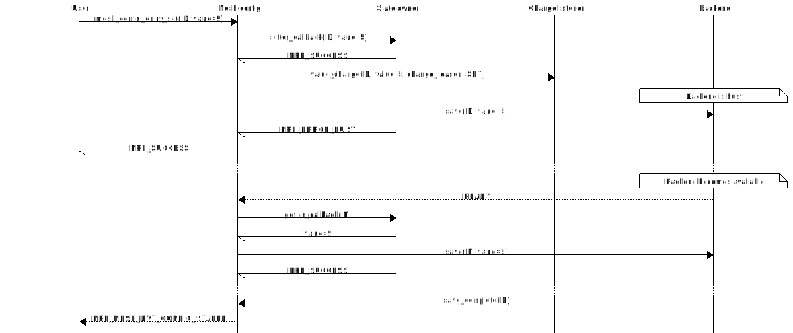

# Mesh config

Mesh config is a mesh submodule designed to abstract and simplify persistent key-value storage.
It provides a high-level API with swappable storage backends that can be used to store mesh and
application state.

## Overview

The mesh config module organizes data in files, where each file has a set of records. A mesh
config entry is uniquely identified by a file/record pair, and it can represent any
immutable structure with a predefined size.

### State owners

An entry is owned by a *state owner* module in the user-space. The state owner holds the entry
structure and is responsible for sanitizing and storing the live representation of the value. It
provides access to the live value through a `setter`/`getter`/`deleter` interface.

There is no requirement that the state owner must keep the live value in RAM, but it must be able to produce the
value on the mesh config module's request atomically. The live value should never be altered outside
the state owner's `setter` callback, and the `getter` callback should always return the value set
in the previous `setter` callback. The state owner can specify a default value to use if the entry
has not been set. If no default value is defined, attempts to read the value will result in an error
until the value has been set or loaded from persistent storage.

The state owner is notified of deleted entries through the `deleter` callback. It cannot interfere
with the deletion, only observe it.

The state owner may choose to reject values it considers invalid by returning an error code from its
`setter` callback.

### Change listeners

In some cases, other modules need to passively listen to changes to a specific entry.
For instance, the internal mesh Heartbeat module needs to know when the Proxy feature is enabled, as
this should trigger the Heartbeat module to publish a message. This pattern is a common source of
unwanted coupling between modules, and to reduce this, the mesh config module provides a
@ref MESH_CONFIG_LISTENER_MODULE for registering passive change listeners without needing to involve
the state owner. Any module can register a listener for any entry and is then notified of any
state changes after they have been sanitized by the state owner.

### Backends

The mesh config module is designed to work on top of any key-value storage backend. In the initial
version of mesh config, the only supported backend is the @ref FLASH_MANAGER, but support for other
backends is planned for future releases.

The mesh config backend API is considered internal and should never be called directly.

## Information flow

All user interaction with the mesh config module should go through the mesh_config API. Manipulating
the live value directly causes the mesh config module to fall out of sync.

### Loading from persistent storage


### Setting a value



Note that the state owner's `setter` callback is called before the value is stored persistently.
The entry should only be considered safely stored after the mesh config module emits an
@ref NRF_MESH_EVT_CONFIG_STABLE event. The user can also call @ref mesh_config_is_busy to determine
whether the live values are in sync with the persistent storage.

### Getting a value


## Usage in the mesh

The mesh config module is used internally in the mesh to store options (through the @ref MESH_OPT
API) as well as runtime state. The mesh reserves the following file IDs:

| File ID            | Owner       | Purpose
|--------------------|-------------|---------
| `0x0000`           | `net_state` | Network runtime state, such as sequence number and IV index.
| `0x0001`           | `dsm`       | Device State manager state, such as keys and addresses.
| `0x0002`           | `access`    | Access state, such as model key bindings.
| `0x0003`           | `mesh_opt`  | Mesh runtime options.
| `0x0004`- `0x000F` | -           | Reserved for future use.


## Usage in the application

The application may use the mesh config module to store their own state. To do this, first declare
a mesh config file with a unique file ID using the @ref MESH_CONFIG_FILE macro:

```C
MESH_CONFIG_FILE(m_app_file, 0x0010, MESH_CONFIG_STRATEGY_CONTINUOUS);
```

The file will automatically be registered in mesh config. The `CONTINUOUS` storage
strategy will ensure that the file's entries will be stored in persistent memory as soon as
they are set.

To create entries, invoke the @ref MESH_CONFIG_ENTRY macro with a setter and a getter function.
This example creates an entry with record number `0x0001` in the `m_app_file` created above.
The value is a uint32_t, configured to only accept values below 10000, with the default value 5000.

```C

#define APP_ENTRY_ID    MESH_CONFIG_ENTRY_ID(0x0010, 0x0001)

/* Live RAM representation of the value */
static uint32_t m_live_value;


static uint32_t app_entry_setter(mesh_config_entry_id_t id, const void * p_entry)
{
    const uint32_t * p_value = (const uint32_t *) p_entry;
    if (*p_value >= 10000)
    {
        /* Rejecting an invalid value. The value will not be stored to persistent storage. */
        return NRF_ERROR_INVALID_DATA;
    }

    m_live_value = *p_value;
    return NRF_SUCCESS;
}

static void app_entry_getter(mesh_config_entry_id_t id, void * p_entry)
{
    uint32_t * p_value = (uint32_t *) p_entry;
    *p_value = m_live_value;
}


/* Default value used if the setter hasn't been called: */
static const uint32_t m_default_value = 5000;

MESH_CONFIG_ENTRY(m_app_entry,
                  APP_ENTRY_ID,
                  1, // The entry is singular
                  sizeof(uint32_t),
                  app_entry_setter,
                  app_entry_getter,
                  NULL, // No need for a delete callback
                  &m_default_value);
```

The config entry is registered automatically, and the user may set and get the value:

```C
void user_function(void)
{
    uint32_t set_value = 19;
    mesh_config_entry_set(APP_ENTRY_ID, &set_value);

    uint32_t get_value;
    mesh_config_entry_get(APP_ENTRY_ID, &get_value);

    // get_value == set_value
}
```
