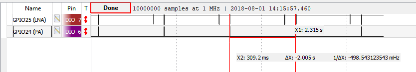

# PA/LNA module

The nRF5 SDK for Mesh provides a PA/LNA module with APIs for interfacing external Front End Modules
(FEMs) to increase the range of Bluetooth Low Energy communication.

The FEMs are controlled by the enable signals that turn on a power amplifier (PA) or
a low noise amplifier (LNA) (see the following figure). To ensure sufficient ramp-up time,
these signals must be activated some time before the start of the radio transmission or reception.

@anchor pa-lna-Figure1


The Mesh PA/LNA module enables users to control such external components using GPIOs
that are synchronized to the radio operation. The PA/LNA module drives the chosen GPIO pins
according to the chosen polarity (Active High/Active Low).

See the following section for an example of how to use the PA/LNA module.
You can find more information about the available APIs
in the [PA/LNA API documentation](@ref MESH_PA_LNA).

---

## Adding PA/LNA support to the application

This section describes how to add PA/LNA support to the `light_switch/server` example.
For more information about this example, see @ref md_examples_light_switch_README
and @ref md_examples_light_switch_server_README.

To add the PA/LNA support:
-# Select the unused GPIO pins that can be used by the PA/LNA module.
    - For this example, we use GPIO 25 for controlling the LNA and GPIO 24 for controlling the PA.
    - Let's assume that the control signals required by the external hardware module are Active High.
    The Mesh PA/LNA module uses the @link_52832_PPI and @link_52832_GPIOTE hardware modules
    to generate these signals.
-# Select the unused PPI channels 0 and 1, and the GPIOTE channel 0.
-# Make the following changes in `light_switch/server/src/main.c`:
    -# Include the required module header file: `mesh_pa_lna.h`
    -# Create a static global variable of type @ref mesh_pa_lna_gpiote_params_t and initialize it
    with the selected values:
```
        static mesh_pa_lna_gpiote_params_t m_pa_lna_params = {
                .lna_cfg = {
                    .enable = 1,
                    .active_high = 1,
                    .gpio_pin = 25
                },
                .pa_cfg = {
                    .enable = 1,
                    .active_high = 1,
                    .gpio_pin = 24
                },
                .ppi_ch_id_set = 0,
                .ppi_ch_id_clr = 1,
                .gpiote_ch_id = 0
            };
```
    -# Enable the PA/LNA module by calling @ref mesh_pa_lna_gpiote_enable() after the call to
    `mesh_init()`:

        mesh_pa_lna_gpiote_enable(&m_pa_lna_params);
-# Build the example by following the instructions in @ref md_doc_getting_started_how_to_build.
-# Run the example by following the instructions in @ref md_doc_getting_started_how_to_build
for [commands required to program a device using `nrfjprog`](@ref how_to_run_examples_nrfjprog).

If you connect a logic analyzer to the GPIO pins 25 and 24, you will see them toggling.

The unprovisioned device sends the unprovisioned node beacons every
two seconds (@ref NRF_MESH_PROV_BEARER_ADV_UNPROV_BEACON_INTERVAL_MS) and scans for
the incoming provisioning invite for the rest of the time.



You will see brief Active High pulses on the GPIO pin 24, which is used for the PA control.
Similarly, the GPIO pin 25 (used for the LNA control) is almost always ON,
except for the time when the radio switches to the next advertising channel for scanning
or for sending advertisements.

