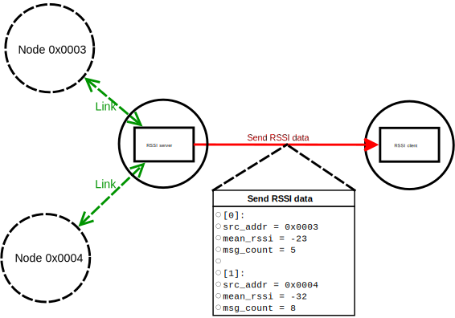
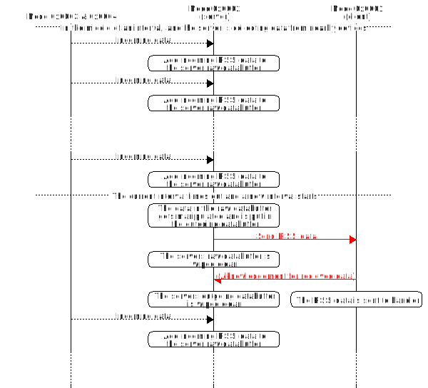

# RSSI model

The Received Signal Strength Indicator (RSSI) model collects information about the strength
of the signal between different mesh devices and sends this data to a centralized point
of the mesh network for further analysis. Use this model to simplify the process of monitoring
the overall signal quality in a mesh network, for example a ligthing network in a office building,
where the installer could utilize this model to ensure that the coverage of the network
is sufficient.

**Table of contents**
- [Properties and features](@ref rssi_model_properties_features)
- [Implementing the model](@ref rssi_model_implementation)
- [Message format](@ref rssi_model_message_format)
    - [Send RSSI data message](@ref rssi_model_message_format_send)
    - [Reply status message](@ref rssi_model_message_format_reply)
    - [Message opcodes](@ref rssi_model_message_format_opcodes)

The model is centered around the server. The server continuously takes samples with the RSSI data
from the messages that arrive at the server’s mesh device. At a set interval, the server forwards
a processed version of the data to the client. Each message received by the client is acknowledged
with a reply to the server. The server expects this acknowledgement before it wipes
the outgoing data buffer. If the message transaction is not successful within 30 seconds,
the server will still wipe this data. While there is an ongoing data transfer between the client
and the server, the raw data buffer will be wiped, and it will start accumulating any new samples
that are added. This means that the server can collect data while you are waiting
for a data transfer to complete.

The following figure shows an example network with four devices at the exact moment
when an interval has expired and a the RSSI data message has been sent from the sever to the client.

In this figure, the node 0x0001 is an implementation of the client model and the node 0x0002
is an implementation of the server model. The RSSI message contains all the collected data
from the last interval, and the server has registered two links, one from the node 0x0003
and one from the node 0x0004.

See the following figure for the message flow of the mesh network from Figure 1
during a time interval.

---

## Properties and features @anchor rssi_model_properties_features

The RSSI model consists of two models:
- client model (ID 0x0006)
- server model (ID 0x0005)

The RSSI model does not generate its own data. It uses (leeches) metadata generated
by messages passing from other model operations.

The server model sends the collected data to the client at a set time interval.
All messages sent from the server are acknowledged by the client upon arrival.
The time interval can be configured with the @ref CONFIG_MODEL to suit the specific application.

The number of entries in one message depends on the number of unique links that has been registered
since the last time a message was sent. By default, the server model raw database buffer can contain
up to 20 unique link entries. This value can be altered by defining RSSI_DATA_BUFFER_SIZE with
the desired maximal value in the preprocessor. When this buffer is full, the server model ignores
attempts to add new entries until the current entries are sent and the buffer is wiped.

The maximal number of entries in a single on-air message is also equal
to RSSI_DATA_BUFFER_SIZE. For this reason, use a value that will not allow a exessive amount
of messages to go on air at the same time, since this will affect the on-air capacity.

---

## Implementing the model @anchor rssi_model_implementation

Before implementing the model, take note of the following requirements:
- Each server implementation must publish to the unicast address
associated with the RSSI client implementation.
- When the server models are initially configured, the publish period must be set to a value
greater than zero. Otherwise, the server will never publish any messages to the client.

@note
The steps that mention the API functions after the initialization step 1 are handled
by the @ref CONFIG_MODEL, but are reported here for the local configuration of each device.

To implement the RSSI client model on a device:
-# Initialize the model with `rssi_client_init()` from the model API.
-# Bind and set the app-key for the model through the `access_model_application_bind()`
and `access_model_publish_application_set()` API functions.
  
To implement the RSSI server model on a device:
-# Initialize the model with `rssi_server_init()` from the model API.
-# Bind and set the application key for the model with the `access_model_application_bind()`
and `access_model_publish_application_set()` API functions.
-# Set the publication address for the model with the `access_model_subscription_add()` API function
(see the requirements mentioned above).
-# Set the publication period for the model with the `access_model_publish_period_set()`
API function.
    - Before choosing the span of the time window, consider the granularity of the period
    between each message sent by the server. Since the server computes an average signal value before
    the message is sent to the client, you can only see the general trend of the signal strength
    from the last time window. If the time window gets too long, it can lead to overlooking
    of some of the finer details in the signal mapping. On the other hand, if the time window
    gets shorter, you must provide a sufficient number of samples to the server model
    to get consistent data. In this case, consider also the on-air footprint the model will make.

    
---

## Message format @anchor rssi_model_message_format

The RSSI model uses the following types of messages:
- Send RSSI data
- Reply status 

### Send RSSI data message @anchor rssi_model_message_format_send

This message contains the data collected by the servers.
The data is stored in an array that by default can contain up to 20 entries, depending
on how many links the server has registered. 

See the following table for the entry structure breakdown.

| Member name  |  Type    | Description                                                           |
| ------------ | -------- | --------------------------------------------------------------------- |
| src_addr     | uint16_t | Element address of the device that is the source of this link.        |
| mean_rssi    | uint8_t  | Average RSSI value of the link in the previous time interval.         |
| msg_count    | uint8_t  | Number of samples received on this link in the previous time interval.|

### Reply status message @anchor rssi_model_message_format_reply

This message acknowledges that the server data has arrived to the client.

| Member name  | Type  | Description            |
| ------------ | ----- | ---------------------- |
|      -       |   -   | This message is empty. |

### Message opcodes @anchor rssi_model_message_format_opcodes

| Message name   | Opcode  | Direction            |
| -------------- | ------- | -------------------- |
| Send RSSI data | 0x8039  | Server -> Client     |
| Reply status   | 0x8038  | Client -> Server     |
