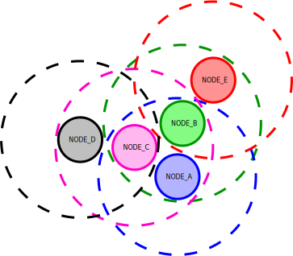
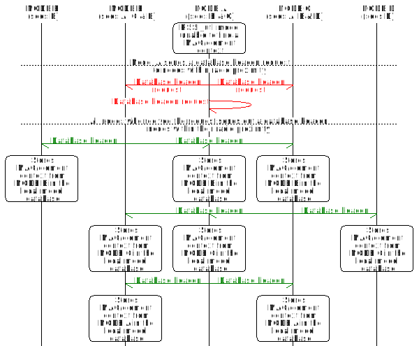

# RSSI util model

The Received Signal Strength Indicator (RSSI) utility model establishes and maintains
a local database on each physical device in a mesh network. The database contains
MAC and element address pairs of other devices within the radio range. 

By using this model, you can identify the physical device that was responsible for sending
or forwarding a message to another device based on the element addresses.

**Table of contents**
- [Properties and features](@ref rssi_util_properties_features)
- [Implementing the model](@ref rssi_util_implementing)
- [Message format](@ref rssi_util_message_format)
    - [Database beacon request message](@ref rssi_util_message_format_beacon_request)
    - [Database beacon message](@ref rssi_util_message_format_beacon)
    - [Message opcodes](@ref rssi_util_message_format_opcodes)

The local database of the model is generated by sending out the database beacon request.
This request is sent out whenever the interface of the model receives a MAC address
whose corresponding element address context does not appear in the local database.

The database beacon request is a broadcast message that reaches all other mesh devices
within the radio proximity. All devices that receive the database beacon request respond
by sending a database beacon, a return message that contains the MAC or the element context
of the mesh device.

The database beacon is also a broadcast message, which means it is received not only
by the mesh device that requested the database beacon, but by every device
within the radio proximity.

The intention for using a many-to-many implementation for exchanging MAC and element contexts
between mesh devises is to:
- ensure that the information in all databases is up-to-date;
- prevent the database beacon request events from occurring frequently.

See the following figure for the depiction of the radio reach of each device
(dotted circle in the matching color).

Based on this radio reach, see the following figure for the event timeline and what happens
when the model is not able to find an element address that corresponds to a MAC address.

@note The model was created with the assumption that the database beacon exchanges should primarily
occur on bootup of a mesh device.

The messages in this model only reach mesh devices within the radio proximity.
The mapping of a MAC address to a Mesh address is guaranteed by setting the TTL value
of the messages to 0, which ensures that no devices relay them beyond the radio proximity.
This way, you can pair up the element address within the message with the MAC address contained
in the metadata that follows the message. This is because the model that sent the database beacon
must be both the first and the last device involved in the message exchange.

The mapping of MAC addresses to Mesh unicast addresses is only useful for MAC addresses
that stay the same for all messages. As RANDOM_PRIVATE MAC addresses are supposed to change
for every message to maintain anonymity, they can be ignored. Although other address types
are technically allowed to change between packets, this happens so rarely that you can map them
to Mesh addresses with acceptable accuracy.

---

## Properties and features @anchor rssi_util_properties_features

The ID of the RSSI util model is 0x0007.

The RSSI util model is implemented as a single controller model.
It is designed to function only with MAC addresses of the adjacent physical devices in the mesh.
If you input a MAC address of a device that is not within one radio hop of the origin,
the model will not be able to retrieve the corresponding element address.

The address database is not contained in persistent memory and it will be wiped on reset.

---

## Implementing the model @anchor rssi_util_implementing

Before implementing the model, take note of the following requirements:
- To work properly, this model must be implemented in every mesh node of a network.
- All instances of this model must publish and subscribe to the same group address in the mesh.

@note
The steps that mention the API functions after the initialization and the allocation steps
(steps 1 and 2) are handled by the @ref CONFIG_MODEL, but are reported here for
the local configuration of each device.

To implement the RSSI util model on a device:
-# Initialize the model with the `rssi_util_init()` function from the model API.
-# Allocate a subscription list with the `access_model_subscription_list_alloc()` API function.
-# Bind and set the application key for the model with the `access_model_application_bind()`
and the `access_model_publish_application_set()` API functions.
-# Set the publication address for the model with the `access_model_subscription_add()` API function.
-# Set the subscription address for the model with
the `access_model_publish_address_set()` API function.

---

## Message format @anchor rssi_util_message_format

The RSSI util model uses the following types of messages:
- Database beacon request
- Database beacon

### Database beacon request message @anchor rssi_util_message_format_beacon_request

This message initiates a database beacon from other mesh devices.  

| Member name  | Type  | Description           |
| ------------ | ----- | --------------------- |
|      -       |   -   | This message is empty.|

### Database beacon message @anchor rssi_util_message_format_beacon

This message contains the element address context of a mesh device.

| Member name   |  Type    | Description                                                |
| ------------- | -------- | ---------------------------------------------------------- |
| address_start | uint16_t | The first address in the range of unicast addresses.       |
| count         | uint16_t | The number of addresses in the range of unicast addresses. |

### Message opcodes @anchor rssi_util_message_format_opcodes

| Message name            | Opcode  | Direction of message     |
| ----------------------- | ------- | ------------------------ |
| Database beacon request | 0x8040  | Controller -> Controller |
| Database beacon         | 0x8041  | Controller -> Controller |